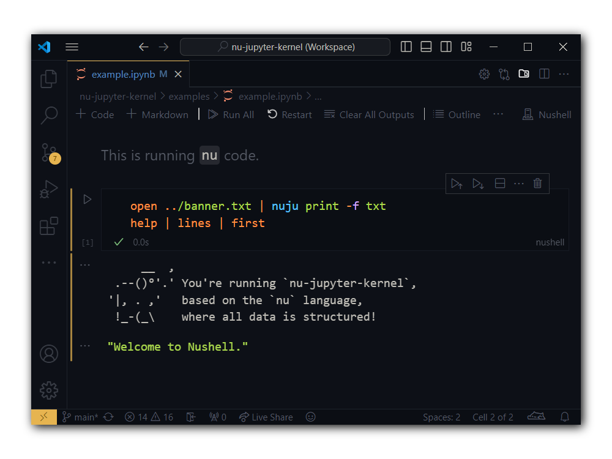

<h1 align="center">nu-jupyter-kernel</h1>
<p align="center">
  <b>
    A wip 
    <a href="https://jupyter.org">jupyter</a> 
    <a href=https://jupyter-client.readthedocs.io">raw kernel</a> 
    for <a href="https://www.nushell.sh">nu</a>.
  </b>
</p>

<br>

<p align="center">
  <a href="https://github.com/cptpiepmatz/nu-jupyter-kernel">
    
  </a>
  <a href="https://github.com/nushell/nushell">
    
  </a>
  
  <a href="https://github.com/cptpiepmatz/nu-jupyter-kernel/blob/main/LICENSE">
      
  </a>
</p>

## About
`nu-jupyter-kernel` is a work-in-progress [Jupyter](https://jupyter.org) kernel
specifically for executing Nu pipelines. 
Unlike most Jupyter kernels that rely on Python, this raw kernel directly 
implements the Jupyter messaging protocol, allowing direct communication without 
Python intermediaries. 
It's designed to work seamlessly with Nu, the language utilized by 
[Nushell](https://github.com/nushell/nushell) — 
a modern shell that emphasizes structured data.



## Features
The `nu-jupyter-kernel` already has several features making it a useful kernel 
for Jupyter notebooks:

- **Execution of Nu code:** 
  Directly run Nu pipeplines within your Jupyter notebook.

- **State sharing across cells:** 
  Unlike isolated script execution, the kernel maintains state across different 
  cells using the `nu-engine`.

- **Rich Data Rendering:** 
  Outputs are dynamically rendered in various data types wherever applicable.

- **Inline Value Printing:** 
  Easily print values at any point during cell execution.

- **Controlled External Commands:** 
  By default, external commands are disabled for reproducibility. 
  You can enable them as needed, and they will function as they do in Nushell.

- **Kernel Information:** 
  Access kernel-specific information via the `$nuju` constant.

- **Error representation:** 
  Shell errors are beautifully rendered.

- **Nushell Plugin Compatibility:** 
  Supports Nushell plugins within notebooks, allowing them to be loaded and 
  utilized as in a typical Nushell environment.

## Design Goals
The design of the `nu-jupyter-kernel` focuses on the following goals:

- **Reproducibility:**
  Notebooks should be as reproducible as possible by default.

- **Clarity in dependencies:** 
  Make all dependencies clear and obvious to the user.

- **Script-like behavior:** 
  The kernel behaves largely like a regular Nu script to ensure familiarity.

- **Clear Feature Distinctions:** 
  Clearly indicating any deviations or limitations compared to standard Nu 
  script capabilities to avoid confusion during notebook executions.

## Installation
Currently, installing the `nu-jupyter-kernel` requires building the kernel from 
source.
Future versions will provide simpler installation methods, but for now, please 
follow the instructions in the Building section below.

## Usage

### Registering the Kernel
After installation, you must register the kernel to make it available within 
Jupyter environments. 
This can be done through the command:

```sh
nu-jupyter-kernel register
```

You can specify the registration scope using `--user` for the current user 
(default) or `--system` for system-wide availability.

### Using the Kernel

- **Jupyter Notebook:** 
  Open Jupyter Notebook, create or open a notebook, and then select "Nushell" 
  from the kernel options in the top right corner.

- **Visual Studio Code:**
  Ensure you have the 
  [Jupyter extension by Microsoft](https://marketplace.visualstudio.com/items?itemName=ms-toolsai.jupyter) 
  installed. 
  Open a `.ipynb` file, click on "Select Kernel", choose "Jupyter Kernel", and 
  you should see "Nushell" listed. 

Both options may require a restart after registering the kernel.

### Note on Updates
Kernel binary updates do not require re-registration unless the binary's 
location changes. 
For developers, keep in mind that running `cargo run register` and 
`cargo run --release register` will result in different binary locations.

## Building
To build the latest kernel, you need to have the nushell repository cloned next 
to the kernel repository:

```sh
# Clone the repositories
git clone https://github.com/cptpiepmatz/nu-jupyter-kernel.git
git clone https://github.com/nushell/nushell.git

# Change directory
cd nu-jupyter-kernel

# Build the kernel
cargo build
```

To build the kernel you need to have the rust toolchain installed, check the [installation guide on rust's official website](https://www.rust-lang.org/tools/install).

## Contributing
Contributions are welcome! 
If you're interested in contributing to the `nu-jupyter-kernel`, you can start 
by opening an issue or a pull request. 
If you'd like to discuss potential changes or get more involved, join the 
Nushell community on Discord. 
Invite links are available when you start Nushell or on their GitHub repository.
